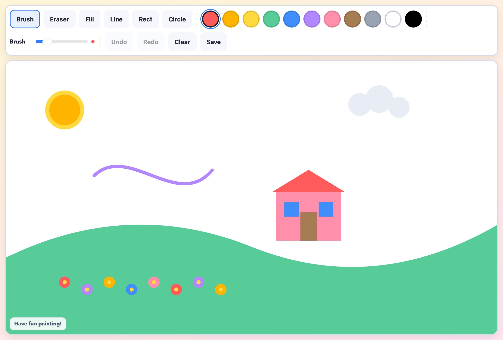

# Easy Paint

A simple, distraction-free native macOS painting app for children.

Built with Cocoa + WebKit and a full-screen child lock so little ones can focus on painting.



## Download

**[Download Easy Paint v1.0.0 for macOS](https://github.com/bunkrich27/EasyPaint/releases/latest)**

Grab `Easy-Paint-v1.0.0-macOS.zip` from the latest release, unzip it, and open **Easy Paint**.

### Install (everyday users)

1. Download `Easy-Paint-v1.0.0-macOS.zip` from the [latest release](https://github.com/bunkrich27/EasyPaint/releases/latest).
2. Double-click the ZIP to extract **Easy Paint.app**.
3. Drag **Easy Paint.app** to your **Applications** folder (optional but recommended).
4. Open **Easy Paint**.

### First launch on macOS (unsigned app)

This release is **ad-hoc signed only**. It is **not** signed with an Apple Developer ID and is **not notarized**. Gatekeeper may block it the first time.

If macOS says the app “cannot be opened because it is from an unidentified developer”:

1. Open **System Settings → Privacy & Security**.
2. Scroll to the message about Easy Paint and click **Open Anyway**.
3. Confirm **Open** in the dialog.

Alternatively, right-click (or Control-click) **Easy Paint.app**, choose **Open**, then click **Open** in the dialog. You only need to do this once.

### Requirements

| | |
|---|---|
| **macOS** | 12.0 Monterey or later |
| **Architecture** | Apple Silicon (`arm64`) only — built and tested on Apple Silicon |
| **Signing** | Ad-hoc signature only (not Developer ID / not notarized) |

Intel Macs are not supported by this binary.

## Features

- **Brush, eraser, fill, line, rectangle, and circle** tools
- **11 colors** — red, orange, yellow, green, blue, purple, pink, brown, gray, white, and black
- **Adjustable brush size** — fine lines to thick strokes
- **Undo & redo**
- **Save** — export the canvas as a PNG
- **Clear** — start fresh with one click
- **Child-lock fullscreen** — launches fullscreen with window controls hidden so kids stay focused
- **Parent exit** — quit with **⌃⌥⌘Q** (Control + Option + Command + Q)

## Privacy

Easy Paint runs **entirely on your Mac**.

- Drawing happens on a local canvas inside the app.
- There is **no account**, **no analytics**, and **no network upload** of drawings or other user data.
- **Save** writes a PNG file you choose on your computer (standard macOS save/download flow).

The app does not send your child’s drawings anywhere.

## Parent exit

While Easy Paint is running in child-lock mode, quit with:

**⌃⌥⌘Q** — Control + Option + Command + Q

## Build from source (developers)

Requirements: macOS with Xcode Command Line Tools (`xcode-select --install`).

```bash
git clone https://github.com/bunkrich27/EasyPaint.git
cd EasyPaint
bash build_app.sh
open "dist/Easy Paint.app"
```

This compiles the Swift shell, generates the app icon, bundles **`dist/Easy Paint.app`**, and creates **`dist/Easy-Paint-v1.0.0-macOS.zip`**.

The build targets the host architecture (currently `arm64`) with a macOS 12.0 deployment target. The app is ad-hoc signed for local use.

## Project structure

```
EasyPaint/
├── Sources/EasyPaint/main.swift   # Native app shell (Cocoa + WebKit)
├── index.html                     # Paint UI (HTML canvas)
├── scripts/generate_icon.swift    # Programmatic icon generator
├── build_app.sh                   # Build & bundle script
├── docs/images/                   # Screenshots for documentation
└── dist/                          # Build output (gitignored)
```

## License

[MIT](LICENSE)
